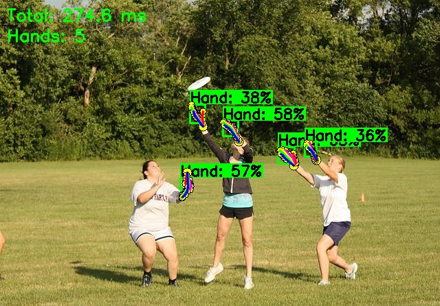
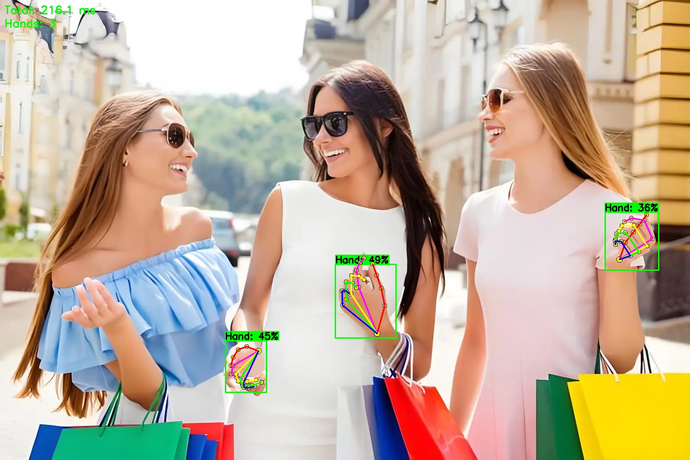

# handpose_x_ncnn
本项目实现了一个完整的手部检测与手部关键点推理系统：

* YOLOv11（NCNN 推理）用于手部目标检测
* Handpose（NCNN 推理）用于 21 点手部关键点检测
* 支持对 ROI 自动扩展、关键点绘制、检测结果可视化
* 基于 C++、OpenCV 与 NCNN

本文档介绍项目的结构、功能、构建方式以及示例用法，便于快速上手。

---

## 功能概述

整个系统工作流程如下：

1. 使用 **YOLOv11** 检测图像中的手部位置。
2. 对每个检测框进行 ROI 扩展，以获取更完整的手部区域。
3. 将 ROI 输入 **Handpose 模型**，获得 21 个手部关键点（坐标随原图尺寸缩放）。
4. 在原图中绘制检测框、手势关键点与骨架。

系统支持多线程处理，适用于实时应用如摄像头输入。

---

## 代码结构简介

### 1. YOLOv11 推理模块

文件：`yolov11.h / yolov11.cpp`

* 使用 NCNN 推理 YOLOv11 模型(nano)。
* 包含 NMS、Proposal 生成、前处理与后处理。
* 输入为 RGB 图像，输出为检测框（类别标签、置信度）。

示例输出对象结构：

```cpp
typedef struct Object {
    cv::Rect_<float> rect;
    int label;
    float prob;
} Object;
```

### 2. Handpose 推理模块

文件：`handpose.h / handpose.cpp`

* 加载手部关键点模型（输出 21×2 = 42 维）。
* 坐标按图像宽高缩放回原图。
* 提供绘制关键点与手部骨架的方法。

关键点输出结构：

```cpp
typedef struct Object_handpose {
    std::vector<cv::Point2f> kpts;  // 21 点
} Object_handpose;
```

### 3. 主程序逻辑（摄像头 / 视频流）

* 多线程读取帧
* YOLOv11 → ROI 扩展 → Handpose
* 绘制最终可视化结果

ROI 扩展示例：

```cpp
cv::Rect expandROI(const cv::Rect& rect, int img_w, int img_h);
```

---

## 模型路径配置

请将以下宏替换为你的 NCNN 模型路径：

```cpp
#define YOLOV11_PARAM_PATH "your/path/yolov8.param"
#define YOLOV11_BIN_PATH   "your/path/yolov8.bin"
#define HANDPOSE_PARAM_PATH "your/path/handpose.param"
#define HANDPOSE_BIN_PATH   "your/path/handpose.bin"
```

---

## 构建与依赖

### 测试依赖

* OpenCV ≥ 3.10
* NCNN：ncnn-20240820-ubuntu-2404
* C++17

### CMake 示例

```cmake
cmake_minimum_required(VERSION 3.10.1)
project(handpose_detect)

set(CMAKE_CXX_STANDARD 17)
add_definitions(-std=c++17)
add_definitions(-pthread)

option(CUDA_USE_STATIC_CUDA_RUNTIME OFF)

# 设置 Release 优化
set(CMAKE_BUILD_TYPE Release)
set(CMAKE_C_FLAGS_RELEASE "${CMAKE_C_FLAGS_RELEASE} -O2")
set(CMAKE_CXX_FLAGS_RELEASE "${CMAKE_CXX_FLAGS_RELEASE} -O2")

# OpenMP 支持
find_package(OpenMP REQUIRED)
if(OpenMP_FOUND)
    message("OpenMP found")
    set(CMAKE_C_FLAGS "${CMAKE_C_FLAGS} ${OpenMP_C_FLAGS}")
    set(CMAKE_CXX_FLAGS "${CMAKE_CXX_FLAGS} ${OpenMP_CXX_FLAGS}")
    set(CMAKE_EXE_LINKER_FLAGS "${CMAKE_EXE_LINKER_FLAGS} ${OpenMP_EXE_LINKER_FLAGS}")
endif()

# OpenCV
find_package(OpenCV REQUIRED)

# ncnn
set(ncnn_DIR "/home/dell/Softwares/ncnn/build/install/lib/cmake/ncnn")
find_package(ncnn REQUIRED)
if(NOT TARGET ncnn)
    message(WARNING "ncnn NOT FOUND! Please set ncnn_DIR environment variable")
else()
    message("ncnn found")
endif()

# Include paths
include_directories(
    ${OpenCV_INCLUDE_DIRS}
    ${PROJECT_SOURCE_DIR}/include
)

# 源文件收集
file(GLOB SRC_FILES src/*.cpp )

# 可执行文件
add_executable(handpose_detect ${SRC_FILES})

# 链接库
target_link_libraries(
    handpose_detect
    ${OpenCV_LIBS}
    ncnn
)
```

编译：

```bash
mkdir build && cd build
cmake .. && make -j
```

## 

##  使用方法

### 1. 摄像头模式（默认）

```bash
./handpose_detect
```

### 2. 图像处理

```bash
# 处理单张图像
./handpose_detect input.jpg

# 处理并保存结果
./handpose_detect input.jpg output.jpg
```

### 3. 视频处理

```bash
# 处理视频
./handpose_detect video.mp4

# 处理并保存结果
./handpose_detect video.mp4 1
```


## 推理结果

- 图像推理

  



- 视频推理

  


### 写在后面

1. 本项目是对[handpose_x](https://github.com/XIAN-HHappy/handpose_x)项目的ncnn移植，原项目是基于python实现的，同时提供了onnx的c++推理。原项目只有对手部关键点回归的代码，这里我增加了手部检测部分。
2. 手部检测是在yolov11n模型上训练的，训练数据来自[[百度网盘密码：c680]](https://pan.baidu.com/s/1H0YH8jMEXeIcubLEv0W_yw)。实际训练时候发现mAP精度挺低的，因为打开数据集查看发现手的部分只占据整张图像很小的一部分，因此算是小目标检测。由于只是抽空更新项目，因此没有专门优化手部检测准确度部分，所以提供的训练检测权重精度并不高。如果大家对精度要求很高的话，建议自己抽时间优化和训练。此外，由于训练的数据集大部分是小目标，测试时发现当手部离摄像头很近的话，检测效果并不理想，我十分建议大家可以采集一些距离摄像头近的图像标注训练，可以增加检测结果的准确性。
3. 手部关键点检测直接是基于[handpose_x](https://github.com/XIAN-HHappy/handpose_x)提供的onnx权重转化到ncnn中实现的，并对此进行了ncnn推理实现。
4. 由于本人的代码水平有限，因此为了能够快速移植和实现，借助了很多ai的平台帮我实现。在这里感谢chatgpt、claude，可以帮助我实现想法和调试。
5. 由于实现手部关键点检测包含手部检测和关键点检测两部分，用cpu推理的话，大概只有10帧左右，不高但是勉强可用。


### 引用

- [handpose_x](https://github.com/XIAN-HHappy/handpose_x)
- [ncnn-android-yolo11](https://github.com/nihui/ncnn-android-yolo11)

<div align="center">

⭐ 如果这个项目对您有帮助，请给一个Star！⭐

